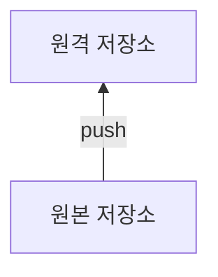
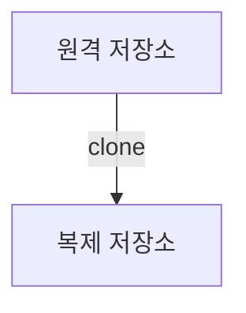
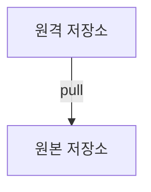
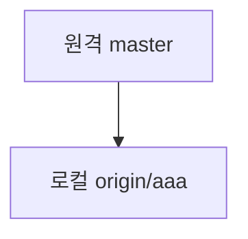
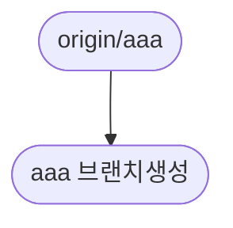

6.9 🔗원격 브랜치 
=
깃은 다수의 개발자와 협업으로 코드를 유지할 수 있다. 주요 개발 작업들은 로컬 저장소에서 하지만 협업은 원격 저장소로도 공유한다.

로컬 저장소도 하나의 저장소고, 원격 저장소도 하나의 저장소이다. 

## 6.9.1 리모트 브랜치

원격 저장소에 생성한 브랜치를 **리모트 브랜치** 라고 한다.


> - 로컬 저장소에 생성한 브랜치, 서버로 공유가 가능
> - 원격 저장소와 로컬 저장소, 동시에 자동으로 되는 게 아냐... **저장소를 동기화**해야
> - 원격 저장소와 로컬 저장소의 브랜치 이름, 일치하지 않아도 OK
> - 리모트 브랜치의 이름은 보통 **별칭/브랜치 이름** 

## 6.9.2 실습 준비

> 원격 저장소에 새로운 저장소를 만들고 기존 로컬 저장소의 hotfix브랜치에서 remote add origin 한다. 그리고 remote -v를 통해 잘 됬는지 확인
```
...
origin ...://.../../asdf.git (fetch)
origin ...://.../../asdf.git (push)
...
```
> 준비 완료
## 6.9.3 브랜치 추적
 - 깃의 브랜치는 특정 커밋 해시값을 가리키는 포인터이다. 리모트 브랜치 또한 원격 저장소의 브랜치를 가리키는 포인터이다.
 - 원격 저장소의 브랜치를 가리키는 것을 **브랜치 추적**이라고 한다.
 - 추적 브랜치를 트래킹 브랜치라고 한다. 
 - 추적 브랜치는 원격 브랜치의 마지막 커밋 해시값을 가리킨다.
 - *이 정보는 .git/refs/ 안에 저장되어 있다.*
```bash
$ ls .git/refs/
```
```
heads tags
```
> 로컬 저장소가 원격 저장소와 연결될 때 원격 브랜치의 트래킹 정보는 자동으로 갱신된다. 
> 
> 로컬 저장소는 마지막으로 연결된 리모트 브랜치의 커밋 해시 값을 항상 가지고 있다.
## 6.9.4 브랜치 업로드
등록된 원격 저장소의 리모트 브랜치를 보려면:
```bash
$ git remote show origin 
```
	* remote origin
	  Fetch URL: ...
	  Push URL: ...
	  HEAD branch: (unknown)

아직 리모트 브랜치는 없는 상태이다.

> 로컬 저장소의 브랜치를 원격 저장소에 동기화하기 위해 push를 한다.
```bash
$ git push -u origin master
```

> 원격 저장소에 가보면 이전에는 없던 master 브랜치가 생성되어 있다.
>
> 다시 로컬 저장소의 브랜치를 확인한다. 브랜치가 4개가 있다. 하지만 원격 저장소에는 브랜치가 1개밖에 없다.
> 
> 로컬 저장소의 hotfix브랜치를 원격 저장소로 등록한다.
```bash
$ git push -u origin hotfix
``` 
> 원격 저장소에 가보면 이전에는 없던 hotfix 브랜치가 추가되어 있다.

## 6.9.5 이름이 다른 브랜치
일반적으로 로컬 브랜치와 원격 브랜치의 이름은 동일하게 사용한다.
하지만 반드시 이름이 똑같아야 하는 법은 없다.

서로 다른 로컬 브랜치와 리모트 브랜치를 수동으로 지정하려면:
```bash
$ git push origin 브랜치이름:새로운브랜치
```
>  git push -u origin feature:function을 한다.
>  로컬 저장소의 feature 브랜치가 원격 저장소에서는 function브랜치로 등록되었다.

## 6.9.6 업스트림 트래킹
업스트림(upstream)은 브랜치 추적을 다르게 표현한 것이다.


로컬저장소의 브랜치와 원격 저장소의 브랜치는 업로드할 수 있도록 **매칭**되어 있다. 이러한 매칭을 **업스트림 트래킹**이라고 한다.


트래킹 브랜치 (업스트림)는 **리모트 브랜치와 로컬 브랜치를 연결해주는 중간 다리 역할**을 한다.  clone 명령어를 쓸 때에 원격 저장소에 등록된 트래킹 브랜치들을 자동으로 함께 설정한다.

> 새로운 폴더에 원격 저장소를 클론한다.

복제된 저장소의 브랜치를 git branch -v 로 확인해보면 master 하나만 표시된다.
원격 저장소의 리모트 브랜치 목록을 확인하려면:
```bash
$ git branch -r
``` 
```
origin/HEAD -> origin/master
origin/function 
origin/hotfix
origin/master
```
모든 브랜치 정보를 확인하고 싶다면:
```bash
$ git branch -a
```
```
* master
...
```
트래킹 브랜치(업스트림) 을 확인하고 싶으면:
```bash
$ git branch -vv
```
	* master 1q2w3e4 [origin/master] master working...
> 복제된 저장소의 master 브랜치가 원격 저장소의 origin/master 로 업스트림 트래킹 된 모습.

깃은 불필요한 브랜치를 다 가져오진 않는다. 만약 다른 브랜치를 새로운 업스트림으로 만들고 싶다면:
```bash
$ git checkout --track origin/브랜치이름
```
> origin/function브랜치를 새로운 업스트림으로 만들었다. 

> function 브랜치에서 작업하고 commit, push하고

 
> 원본 저장소 폴더에서 feature 브랜치로 변경한 뒤 pull 시전. (이전에 git push -u origin feature:function 했다)


> 잘 반영된 것을 볼 수 있다.

## 6.9.7 원격 브랜치 복사
원격 저장소와 로컬 저장소의 브랜치 목록은 다른 개발자가 새로운 리모트 브랜치를 만들 수 있기 때문에 서로 다를 수가 있다.
> 원격 저장소에 새로운 aaa브랜치를 생성한다.

> git fetch, git branch -r로 확인
```
origin/aaa
...
```

> git checkout -b aaa origin/aaa로 로컬의 aaa가 원격저장소의 aaa를 따라가도록 한다.

> git branch -vv로 체크 
```
* aaa 1q2w3e4 [origin/aaa] master working...
...
```
> aaa브랜치에서 코드를 수정한 후 commit
```
* aaa 1q2w3e4 [origin/aaa: ahead 1] testing aaa --------- AHEAD
...
```
> push 후 원격 저장소에서 aaa브랜치 확인. 변경사항이 잘 반영됨.

## 6.9.8 업스트림 연결
기존에 있는 브랜치를 업스트림으로  직접 설정할 수도 있다.
> 원격 저장소에 master부터 새로운 bbb브랜치를 생성한다.

> git fetch, git branch -r 로 확인
```
...
origin/aaa
origin/bbb
...
```

> git chechout -b bug, git branch -vv로 확인

```
...
  aaa 1q2w3e4 [origin/aaa] testing aaa
* bug 5t6y7u7 testing aaa 
...
```

>로컬 저장소에만 있던 bug브랜치를 원격 저장소의 bbb리모트 브랜치로 **업스트림 설정**한다.

> git branch -u origin/bbb 로 원격 저장소 따라가기

```
Branch 'bug' set up to track remote branch 'bbb' from 'origin'.
```
> git branch -vv 로 확인 
```
...
  aaa 1q2w3e4 [origin/aaa] testing aaa
* bug 5t6y7u7 [origin/bbb: ahead 1] testing aaa 
...
```
# 6.10 📬 브랜치 전송
## 6.10.1 브랜치 푸시
깃의 push 는 로컬 저장소의 파일들을 원격 저장소로 전송한다.

```bash
$ git push
```
```
fatal: The current branch master has no upstream branch.
To push the current branch an set the remote as upstream, use

	git push ---set-upstream origin master
...
```
- 처음에 로컬 저장소에 새로운 원격 저장소가 등록되면 커밋과 푸시를 하는 데 업스트림 설정이 필요하다.
- **원격 저장소 연결만으로 업스트림이 자동으로 설정되지는 않는다.** 이는 깃이 원격 저장소의 어느 브랜치에 어떻게 푸시해야 할 지 모르기 때문이다.
- 깃은 이에 친절하게 업스트림이 설정되지 않았고, 설정하는 방법까지 알려준다.

## 6.10.2 브랜치 패치
리모트 브랜치 패치는 일반적인 커밋 패치와 동일하다.

리모트 브랜치를 패치한다고 해서 자동으로 로컬 저장소에 새로운 브랜치가 생성되는 것은 아니다.

패치 동작은 원격 저장소에서 리모트 브랜치의 내용을 내려받기만 할 뿐, 자동으로 병합하지 않기 때문이다.
<br>
<!-- <br><br><hr>-->
리모트 브랜치가 패치되면 단순히 **원격저장소별칭/브랜치** 포인터만 생성한다.

원격 저장소에서 패치된 커밋들을 새로운 로컬 브랜치로 병합하려면 
```bash
$ git merge 원격저장소별칭/브랜치이름
```
을 해야 한다.

> 패치된 브랜치를 병합하지 않고 테스트만 하고 싶을 때는
> ```bash
> $ git checkout -b 임시브랜치이름 origin/브랜치이름
> ```
> 
> 이때는 원격 브랜치의 포인터를 이용해 임시 브랜치를 생성하거나 직접 체크아웃이 가능하다.


