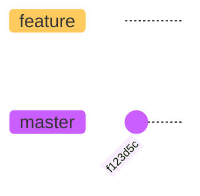
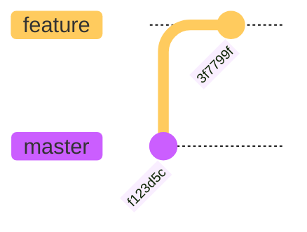
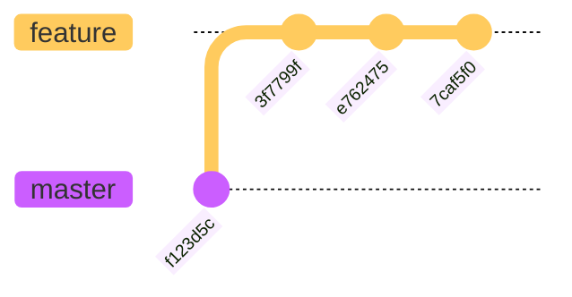
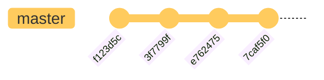

# ️:chains: 8.2 Fast-Forward 병합

- 깃의 가장 간단한 브랜치 병합
- 혼자 개발할 때 사용

> 혼자 개발할 때는 브랜치가 생성된 커밋에 따라 순차적으로 분기됩니다.
> 또 코드 수정도 순차적으로 할 때가 많습니다. 즉, 브랜치가 분기되지만 전체 커밋 그램으로 보면 모든 변경 사항은 순차적으로 진행됩니다.
> 이러한 순차적 커밋에 맞추어 병합을 처리하는 방법이 Fast-Forward 병합입니다.

## 8.2.1 브랜치 생성과 수정 작업

먼저 `feature` 브랜치를 생성한다.
`git rev-parse` 를 통해 포인터를 확인한다.

```bash
git branch feature
git checkout feature
git rev-parse feature
```

```text
f123d5c...
```



> _소스트리에서 확인_
>
> 1. 소스트리의 새 탭에서 **Add** 버튼을 클릭
> 2. **탐색**을 눌러 앞서 만든 폴더를 찾아서 **추가** 누름
> 3. 끝

feature 브랜치 안에 있는 index.htm파일을 수정

```html
<!DOCTYPE html>
<head>
    <meta charset="utf-8">
    <meta name="viewport" content="width=device-width, initial-scale=1">
    <title>Document</title>
</head>
<body>
    
</body>
</html>
```

코드에 변화를 줌.

```html
<!DOCTYPE html>
<head>
    <meta charset="utf-8">
    <meta name="viewport" content="width=device-width, initial-scale=1">
    <title>Document</title>
</head>
<body>
    <header>
    </header>
</body>
</html>
```

커밋. - add header

```bash
git commit -am "add header"
```

```text
[feature 3f7799f] add header
 1 file changed, 2 insertions(+),
```



> _소스트리에서 확인_
>
> feature브랜치가 master 브랜치보다 커밋이 하나 더 있는 것을 볼 수 있다.

또다시 코드에 변화를 줌.

```html
<!DOCTYPE html>
<head>
    <meta charset="utf-8">
    <meta name="viewport" content="width=device-width, initial-scale=1">
    <title>Document</title>
</head>
<body>
    <header>
        <ul>
            <li>깃소개</li>
        </ul>
    </header>
</body>
</html>
```

커밋. - add menu 1

```bash
git commit -am "add menu 1"
```

```text
[feature e762475] add menu 1
 1 file changed, 3 insertions(+),
```

또다시다시 코드에 변화를 줌.

```html
<!DOCTYPE html>
<head>
    <meta charset="utf-8">
    <meta name="viewport" content="width=device-width, initial-scale=1">
    <title>Document</title>
</head>
<body>
    <header>
        <ul>
            <li>깃소개</li>
            <li>깃설치</li>
        </ul>
    </header>
</body>
</html>
```

커밋. - add menu 2

```bash
git commit -am "add menu 2"
```

```text
[feature 7caf5f0] add menu 2
 1 file changed, 1 insertion(+),
```

`git log` 로 커밋 확인

```bash
git log
```

(간략히 표현)

```text
commit 7caf5f0...  (HEAD -> feature)
...
add menu 2

commit e762475...
...
add menu 1

commit 3f7799f...
...
add header

commit f123d5c...   (master)
...
first
```

> _소스트리에서 확인_
>
> .



이러한 모양의 브랜치에서 병합 작업을 할 때에는 Fast-Forward 방식의 알고리즘이 적용됨.

## 8.2.2 병합 위치

깃의 `merge` 명령어는 브랜치를 병합한다. 현재 브랜치를 기준으로 다른 브랜치의 모든 커밋을 병합한다.

```bash
git merge [브랜치이름]
```

master 브랜치로 이동

```bash
git checkout master
```

(간략하게)

```text
Switched to branch 'master'
...
...                    /// (master)
```

코드 내용 확인. feature 브랜치에서 작업한 내용이 없음.

```bash
code index.htm
```

```html
<!DOCTYPE html>
<head>
    <meta charset="utf-8">
    <meta name="viewport" content="width=device-width, initial-scale=1">
    <title>Document</title>
</head>
<body>
    
</body>
</html>
```

## 8.2.3 Fast-Forward 병합 적용

```bash
git merge feature
```

 시전.

```git-bash
...
Updating 1ut891a..r10ioh2
Fast-forward
index.htm | 6 ++++++
1 file changed, 6 insertions(+)
```

Fast-Forward 라고 표시된 것을 볼 수 있다.


----



이 그림처럼 feature 브랜치의 커밋들이 하나씩 master 브랜치로 병합한다. master 브랜치에는 커밋이 하나도 없기 때문에 feature 브랜치가 master 브랜치로 이동한 것처럼 보인다.

> _소스트리에서 확인_
>
> asdf
이처럼 병합한 후에는 master 브랜치의 마지막 커밋 위치와 feature 브랜치의 마지막 커밋 위치가 같다.
> 동일한 HEAD 포인터를 가지게 되는 것이다.

`git log` 시전

```bash
git log -1
```

(간략하게)

```text
commit 7caf...  (HEAD -> master,  feature)
...
add menu2
```

Fast-Forward 병합은 작업한 브랜치를 원본 브랜치에 병합할 때 **작업한 브랜치의 시작 커밋을 원본 브랜치 이후의 커밋으로 가리킨다.**
이는 단순히 커밋 위치를 최신으로 옮기는 것과 비슷하다.

index.htm 파일을 확인한다. 전에 작업한 내용들이 잘 남아있다.

```bash
code index.htm
```

```html
<!DOCTYPE html>
<head>
    <meta charset="utf-8">
    <meta name="viewport" content="width=device-width, initial-scale=1">
    <title>Document</title>
</head>
<body>
    <header>
        <ul>
            <li>깃소개</li>
            <li>깃설치</li>
        </ul>
    </header>
</body>
</html>
```

> Fast-Forward 병합은 병합할 하나의 브랜치 파일을 기준 브랜치로 복사하여 수정된 파일을 원본에 그래도 적용한 것과 같다.
> 즉, 원본에 추가된 내용이 없다는 가정하에 변경한 파일을 대체하는 것이다.
